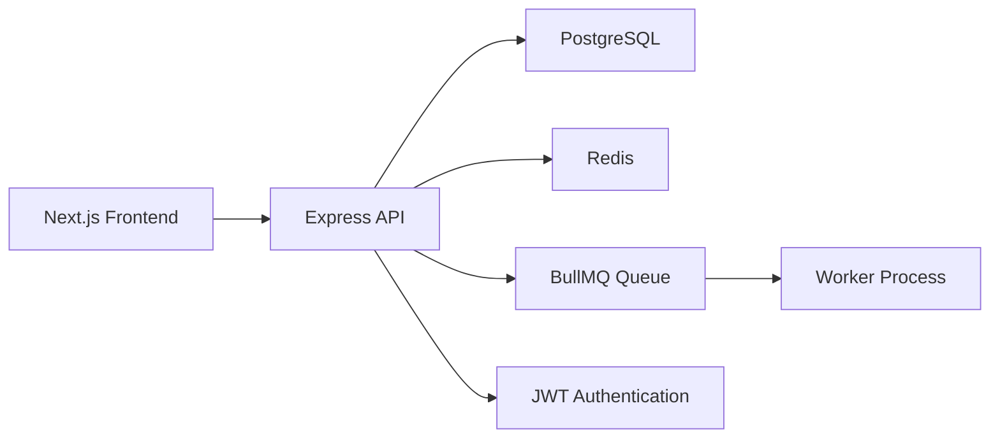

# Social Media Analytics Dashboard

  

A work-in-progress full-stack dashboard for social media analytics, combining a Next.js frontend with an Express backend, PostgreSQL persistence, Redis caching, and BullMQ-based background refresh jobs.

## Overview

This repository contains a prototype social media analytics application with:

- a dark-themed dashboard UI built with Next.js and React
- an Express API for dashboard data, authentication, and analytics-related routes
- PostgreSQL and Redis integration for data access and cache-backed reads
- a queue and worker setup for background analytics refresh flow

The project is currently in an early development stage and should be viewed as a technical prototype rather than a fully completed product.

## Key Features

### ✅ Implemented Features

- Next.js dashboard shell with sidebar navigation and a visual overview page
- Recharts-based followers growth chart in the dashboard UI
- Express server with health check and route-based API structure
- Authentication endpoints for signup and login using bcrypt and JWT
- Protected profile route guarded by JWT middleware
- Analytics endpoint that reads from PostgreSQL and uses Redis caching
- BullMQ queue and worker scaffold for analytics refresh jobs
- Dashboard route returning sample statistics and follower growth data

### 🚧 Features In Progress

- End-to-end integration between the frontend dashboard and backend APIs
- Real analytics data ingestion and persistence flow
- Frontend authentication experience and protected pages
- Database schema setup and seed data preparation

### 📌 Planned Features

- Additional dashboard sections such as Platforms, Trends, and Settings, which are already referenced in the current sidebar navigation
- More complete analytics filtering and reporting views
- Production-ready deployment, monitoring, and environment hardening

## Tech Stack

### Frontend

- Next.js 16
- React 19
- TypeScript
- Tailwind CSS
- Recharts
- lucide-react

### Backend

- Node.js
- Express
- JSON Web Tokens (jsonwebtoken)
- bcrypt
- dotenv

### Data & Caching

- PostgreSQL
- Redis
- BullMQ

### Development Tools

- ESLint
- Nodemon

## Architecture Overview

The current codebase follows a simple layered architecture:



## Project Structure

```text
SOCIAL-MEDIA-ANALYTICS-DASHBOARD/
├── social-analytics-backend/
│   ├── src/
│   │   ├── config/        # Environment, database, and Redis configuration
│   │   ├── controllers/   # Authentication and request handlers
│   │   ├── middleware/    # JWT auth middleware
│   │   ├── queues/        # BullMQ queue setup
│   │   ├── routes/        # API route definitions
│   │   ├── utils/         # Helper utilities
│   │   └── workers/       # Background job worker
│   ├── server.js          # Express entry point
│   └── package.json
├── social-analytics-frontend/
│   ├── app/
│   │   ├── components/    # Navbar and sidebar UI
│   │   ├── dashboard/     # Dashboard page and chart components
│   │   └── page.tsx       # Root app entry
│   └── package.json
└── README.md
```

## Installation

### Prerequisites

- Node.js and npm
- PostgreSQL running locally or remotely
- Redis running locally or remotely

### Backend Setup

```bash
cd social-analytics-backend
npm install
```

Create environment variables before starting the server (see the next section). Then run:

```bash
npm run dev
```

The backend listens on port 5000 by default unless overridden by the environment.

### Frontend Setup

```bash
cd social-analytics-frontend
npm install
npm run dev
```

Open http://localhost:3000 in your browser.

> The current frontend dashboard calls the backend at http://localhost:5000, so the backend should be running for dashboard data to load.

## Environment Variables

The backend expects the following environment variables to be set:

| Variable    | Required | Description                     |
| ----------- | -------- | ------------------------------- |
| PORT        | Yes      | Port for the Express server     |
| DB_HOST     | Yes      | PostgreSQL host                 |
| DB_PORT     | Yes      | PostgreSQL port                 |
| DB_USER     | Yes      | PostgreSQL username             |
| DB_PASSWORD | Yes      | PostgreSQL password             |
| DB_NAME     | Yes      | PostgreSQL database name        |
| REDIS_HOST  | Yes      | Redis host                      |
| REDIS_PORT  | Yes      | Redis port                      |
| JWT_SECRET  | Yes      | Secret key used for JWT signing |
| NODE_ENV    | No       | Runtime environment name        |

Example:

```env
PORT=5000
DB_HOST=localhost
DB_PORT=5432
DB_USER=postgres
DB_PASSWORD=your_password
DB_NAME=social_analytics
REDIS_HOST=localhost
REDIS_PORT=6379
JWT_SECRET=replace_with_a_secure_secret
NODE_ENV=development
```

## Usage

1. Start PostgreSQL and Redis.
2. Start the backend from the backend folder.
3. Start the frontend from the frontend folder.
4. Open the dashboard in the browser.

The current API surface includes:

- GET /health for a basic health check
- GET /dashboard for sample dashboard data
- POST /auth/signup for user registration
- POST /auth/login for user authentication
- GET /protected/profile for a protected example route
- GET /analytics/daily for cached analytics data
- POST /refresh or /test/refresh to queue a refresh job

## Current Project Status

### Completed

- Monorepo structure for frontend and backend
- Dashboard UI scaffold and chart display
- Backend routing and middleware setup
- Authentication route scaffolding
- Redis and BullMQ integration points
- Sample dashboard response data

### In Progress

- Connecting the UI to real backend data
- Finalizing database-backed analytics flows
- Improving authentication and protected routes
- Adding a more complete set of app screens and user interactions

### Missing

- Formal database migrations or seed scripts
- Automated tests
- Deployment configuration
- Full production-ready authentication and authorization flow

### Known Limitations

- Some routes and values are hard-coded, including a fixed user ID in analytics-related logic
- The dashboard currently uses sample data in the backend response
- The repository does not appear to include a dedicated test suite or deployment pipeline
- UI pages referenced in the sidebar are not yet implemented as full features

## Future Improvements

Potential next steps that naturally extend the current implementation include:

- Replacing hard-coded sample values with real database-backed analytics
- Adding migrations and seed data for users, posts, and metrics
- Expanding the dashboard with richer filters and more charts
- Implementing the remaining UI sections referenced by the sidebar
- Adding automated tests and CI/CD workflow
- Containerizing the application for easier local and cloud deployment

## Contributing

Contributions are welcome. Since this repository is still evolving, please keep changes focused and aligned with the current prototype scope. If you plan to make a substantial change, it is best to open an issue or discuss the intended direction first.

## License

No repository-level license has been specified.
