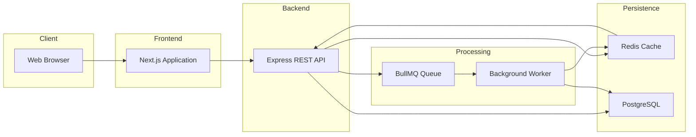
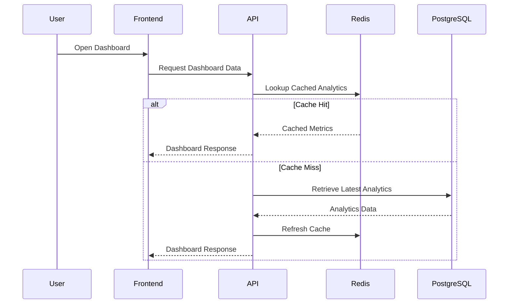
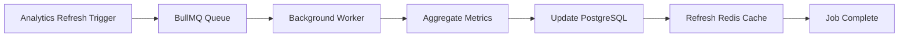
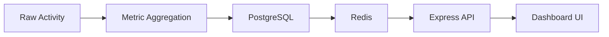
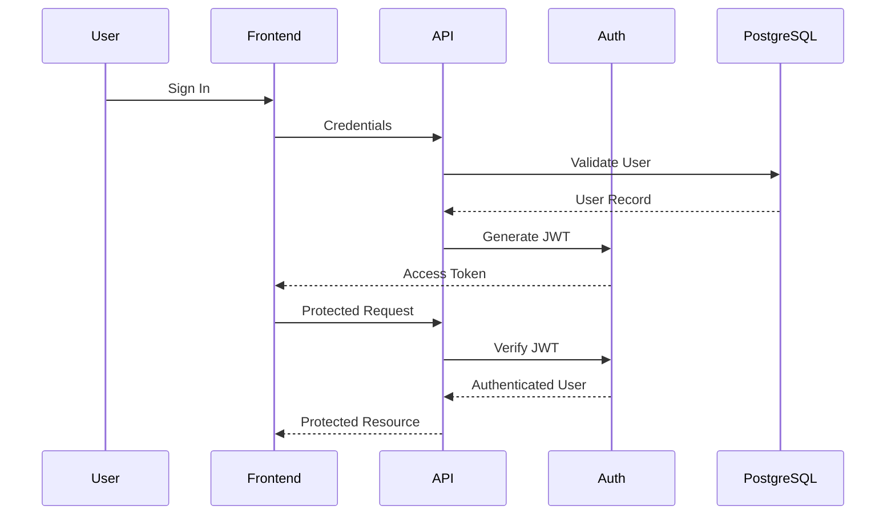

# Social Media Analytics Dashboard

<p align="center">


</p>

A production-inspired social media analytics platform that processes, aggregates, caches, and visualizes engagement metrics through a scalable API-first architecture.

Analytics aggregation is computationally expensive and scales poorly when performed synchronously. Rather than computing metrics during every dashboard request, the platform decouples request handling from analytics computation using Redis-backed caching and BullMQ-powered background workers. This allows dashboard responses to remain fast while expensive analytics processing executes asynchronously in the background.

The project was built to explore production-oriented software engineering concepts—including layered backend architecture, asynchronous workflows, cache-first API design, secure authentication, and reusable frontend systems—through a realistic analytics platform instead of a feature-focused demonstration application.

---

## At a Glance

| Category                  | Details                                  |
| ------------------------- | ---------------------------------------- |
| **Architecture**          | API-first, Layered Architecture          |
| **Frontend**              | Next.js, React, TypeScript, Tailwind CSS |
| **Backend**               | Node.js, Express.js                      |
| **Database**              | PostgreSQL                               |
| **Cache**                 | Redis                                    |
| **Background Processing** | BullMQ Workers                           |
| **Authentication**        | JWT + bcrypt                             |
| **Primary Focus**         | Scalable Analytics Platform              |

## Table of Contents

### 1. Introduction

- [Project Vision](#project-vision)
- [Design Philosophy](#design-philosophy)
- [Key Features](#key-features)

### 2. System Architecture

- [Engineering Highlights](#engineering-highlights)
- [Engineering Trade-offs](#engineering-trade-offs)
- [Architecture Overview](#architecture-overview)
- [High-Level System Architecture](#high-level-system-architecture)
- [Request Lifecycle](#request-lifecycle)
- [Background Job Lifecycle](#background-job-lifecycle)
- [Analytics Pipeline](#analytics-pipeline)
- [Authentication Flow](#authentication-flow)
- [Architectural Principles](#architectural-principles)

### 3. Engineering Decisions

- [Non-Functional Design Goals](#non-functional-design-goals)
- [Design Patterns](#design-patterns)
- [Technology Selection Rationale](#technology-selection-rationale)

### 4. Technology & Implementation

- [Tech Stack](#tech-stack)
- [Local Architecture](#local-architecture)
- [Project Structure](#project-structure)

### 5. Running the Project

- [Installation & Local Development](#installation--local-development)
- [Deployment](#deployment)

### 6. Future Evolution

- [Roadmap (Version 2+)](#roadmap-version-2)

### 7. Operational Qualities

- [Performance & Scalability](#performance--scalability)
- [Security Considerations](#security-considerations)

### 8. Documentation

- [What This Project Demonstrates](#what-this-project-demonstrates)
- [Engineering Decisions (ADR Index)](#engineering-decisions-adr-index)
- [Architecture Documentation](#architecture-documentation)
- [Contributing](#contributing)
- [License](#license)

# Design Philosophy

Traditional web applications execute business logic while serving an incoming request. Analytics platforms operate under different constraints. As datasets grow and aggregations become more expensive, performing analytics synchronously increases response latency, places unnecessary load on the database, and limits the system's ability to scale.

This project is built around a single architectural principle:

> **User requests should retrieve analytics—not compute them.**

```text
                    User
                      │
                      ▼
              Express API
                      │
          ┌───────────┴───────────┐
          │                       │
          ▼                       ▼
     Redis Cache             PostgreSQL
          │
     Cache Hit
          │
          ▼
      API Response

     Cache Miss
          │
          ▼
   Background Worker
          │
          ▼
  Refresh Analytics & Cache
```

Every major architectural decision follows from this principle. The Express API focuses on serving authenticated requests, PostgreSQL remains the system of record, Redis provides low-latency access to precomputed analytics, and BullMQ workers perform computationally expensive aggregation independently of the request lifecycle.

This separation also allows the frontend to remain focused on presenting data rather than orchestrating business logic. By treating the API as the single source of truth, the user interface stays simpler, more reusable, and easier to evolve as the backend grows.

The resulting architecture mirrors the design of modern analytics platforms, where user-facing APIs remain lightweight while asynchronous pipelines independently handle aggregation, caching, and data preparation. Each responsibility can scale independently, improving responsiveness, maintainability, and operational flexibility without increasing the complexity of individual requests.

# Project Vision

Social media platforms generate large volumes of engagement data, but transforming that raw information into actionable insights requires far more than rendering charts on a dashboard. Modern analytics products must continuously collect, aggregate, cache, and serve metrics while maintaining responsive user experiences under increasing workloads.

This project was created to explore how those systems are engineered.

Rather than optimizing for the number of features, the primary objective is to model the architecture of a production-inspired analytics platform—where frontend applications remain lightweight, APIs remain responsive, and computationally expensive work is delegated to independent processing pipelines.

Every subsystem in this repository exists to support that objective. From the separation of request handling and analytics computation to the introduction of caching, background workers, and layered services, the implementation prioritizes architectural clarity, scalability, and maintainability over short-term simplicity.

# Key Features

### Interactive Analytics Dashboard

- Responsive dashboard built with Next.js and React
- Component-driven interface with reusable UI modules
- Interactive follower growth visualization using Recharts
- Platform-specific analytics views
- Time-range filtering
- Loading skeletons, retry states, and graceful error handling

### Secure API Layer

- JWT-based authentication
- Password hashing with bcrypt
- Protected routes using authentication middleware
- Layered REST API architecture with modular routing

### Analytics Processing Pipeline

- Aggregated analytics endpoints
- Background analytics refresh using BullMQ workers
- Redis-backed cache for low-latency dashboard responses
- PostgreSQL as the persistent system of record

### Production-Oriented Engineering

- API-first frontend architecture
- Separation of request handling and analytics computation
- Modular backend organization
- Reusable frontend component architecture
- Environment-based configuration
- Scalable project structure for future platform integrations

# 📸 Screenshots & Demo

The following screenshots showcase the current user interface and highlight the major workflows of the application.

> **Note**
>
> These screenshots represent the current implementation. Additional dashboard modules and analytics views will be added as the platform evolves.

---

## Dashboard Overview


> Landing dashboard displaying key metrics, responsive statistic cards, interactive charts, loading states, and navigation.

---

## Analytics Dashboard


> Interactive analytics visualizations with filters, trend analysis, and platform-specific insights.

---

## Authentication


> Secure JWT-based authentication flow for user login and protected dashboard access.

---

## Responsive Layout


> Responsive interface optimized for desktop, tablet, and mobile devices.

---

## Demo

Coming soon.

# Engineering Highlights

This project is designed to demonstrate architectural patterns commonly found in production analytics platforms rather than individual framework features.

Key engineering decisions include:

- **Asynchronous analytics processing** to prevent expensive aggregation work from blocking user-facing requests.
- **Cache-first API design** that minimizes repeated database queries and reduces dashboard response latency.
- **Layered backend architecture** separating routing, business logic, persistence, background processing, and infrastructure concerns.
- **Component-driven frontend architecture** that isolates presentation from data-fetching responsibilities and encourages UI reuse.
- **Background job orchestration** using BullMQ workers to execute long-running analytics tasks independently of request lifecycles.
- **Clear separation of system responsibilities**, allowing the frontend, API, database, cache, and worker processes to evolve independently as the platform grows.

Collectively, these decisions prioritize scalability, maintainability, and operational simplicity while providing a realistic foundation for extending the platform with additional analytics providers, reporting capabilities, and processing workflows.

# Engineering Decisions & Trade-offs

Software architecture is a series of trade-offs rather than a collection of universally correct decisions. This project intentionally favors long-term scalability and maintainability over minimizing the number of technologies or files.

| Decision                                          | Benefit                                                                                                                                 | Trade-off                                                                                |
| ------------------------------------------------- | --------------------------------------------------------------------------------------------------------------------------------------- | ---------------------------------------------------------------------------------------- |
| **BullMQ for background processing**              | Keeps API requests fast by moving expensive analytics computation out of the request lifecycle.                                         | Introduces an additional service (Redis) and a dedicated worker process to manage.       |
| **Redis as a cache layer**                        | Reduces repeated database queries and improves dashboard response times for frequently requested analytics.                             | Requires cache invalidation strategies and operational overhead.                         |
| **PostgreSQL as the system of record**            | Provides reliable relational storage, transactional consistency, and efficient aggregation capabilities.                                | Analytics queries can become expensive without caching or precomputation.                |
| **Layered backend architecture**                  | Separates routing, business logic, background processing, and infrastructure concerns, making the system easier to maintain and extend. | Increases the number of modules compared to a simpler Express application.               |
| **Independent frontend and backend applications** | Encourages clear API contracts, independent deployment, and better separation of responsibilities.                                      | Adds local development and deployment coordination compared to a monolithic application. |
| **Component-driven frontend**                     | Promotes UI consistency, reusability, and isolated presentation logic.                                                                  | Requires additional abstraction compared to building pages directly.                     |

None of these decisions were made to increase architectural complexity for its own sake. Each exists to solve a specific scalability, maintainability, or operational concern that commonly appears in analytics platforms as they grow beyond a single-process application.

# Architecture Overview

The platform is organized around independently evolving responsibilities rather than tightly coupled application layers. Each subsystem owns a single concern, communicates through well-defined boundaries, and can be scaled or modified without requiring changes throughout the entire application.

At a high level, the architecture separates the system into two execution paths:

- **Request Path** — Optimized for low-latency API responses by serving authenticated requests, retrieving cached analytics, and returning data to the frontend with minimal processing.
- **Analytics Path** — Responsible for computationally expensive work such as metric aggregation, cache refresh, and analytics preparation through asynchronous background workers.

```text
                    Platform
                        │
        ┌───────────────┴───────────────┐
        │                               │
        ▼                               ▼
   Request Path                  Analytics Path

   Low Latency                  High Throughput
   REST API                     Background Workers
   Redis Cache                  BullMQ Queue
   Dashboard Responses          Analytics Aggregation
```

> **Design Principle**
>
> User-facing requests should remain lightweight.
> Expensive computation should occur asynchronously.
> Every architectural decision in this project follows that principle.

This separation ensures that dashboard performance remains predictable regardless of how expensive analytics generation becomes. The frontend communicates exclusively with the REST API, while the API coordinates persistence, caching, and background processing without exposing those implementation details to the client.

# High-Level System Architecture



The system is intentionally divided by responsibility rather than technology.

- **Frontend** focuses exclusively on presentation and user interaction.
- **Backend** exposes a single API boundary for authenticated clients.
- **Persistence** stores and serves analytics efficiently through PostgreSQL and Redis.
- **Processing** performs asynchronous aggregation without increasing request latency.

This separation allows each subsystem to evolve independently while preserving clear ownership and minimizing coupling between components.

# Request Lifecycle



The request lifecycle is intentionally optimized for responsiveness rather than computation. The API's responsibility is to retrieve analytics, not generate them. When cached data is available, responses are returned with minimal latency. On a cache miss, the API retrieves the most recent persisted analytics, refreshes the cache, and returns the response without introducing additional aggregation work into the request path.

This design keeps request latency predictable while allowing the analytics pipeline to evolve independently through background processing, ensuring that user experience is not directly affected by the cost of analytics computation.

# Background Job Lifecycle

Analytics data changes independently of user requests. Rather than recalculating engagement metrics every time a dashboard is opened, the platform refreshes analytics through asynchronous background jobs. This ensures that expensive computation never becomes part of the request lifecycle.



### Responsibility

The background worker is responsible for preparing analytics—not serving them. It aggregates data, persists the latest results, and refreshes cached metrics so future dashboard requests can retrieve precomputed analytics with minimal latency.

### Design Decision

Separating analytics computation from request handling allows dashboard performance to remain stable even as aggregation logic becomes more expensive. New processing stages can be introduced inside the worker without affecting API response times or frontend behavior.

### Trade-off

Introducing asynchronous workers requires additional infrastructure, monitoring, and operational complexity. In return, the API remains lightweight, analytics processing becomes independently scalable, and long-running computation no longer blocks user requests.

# Analytics Pipeline

The analytics pipeline transforms stored activity into dashboard-ready metrics. Rather than exposing raw database records to the frontend, the platform progressively prepares analytics through dedicated processing stages before they are served through the API.



### Responsibility

Each stage has a single responsibility:

| Stage              | Responsibility                                      |
| ------------------ | --------------------------------------------------- |
| Raw Activity       | Source data entering the analytics system           |
| Metric Aggregation | Compute dashboard metrics                           |
| PostgreSQL         | Persist aggregated analytics                        |
| Redis              | Serve frequently requested metrics with low latency |
| Express API        | Expose analytics through authenticated endpoints    |
| Dashboard          | Visualize prepared analytics                        |

### Design Decision

The frontend never computes analytics locally and never queries the database directly. Every visualization is generated from API responses built upon preprocessed metrics. This keeps business logic centralized, improves consistency across clients, and simplifies frontend development.

### Trade-off

Preparing analytics before they are requested introduces additional processing infrastructure, but dramatically reduces response latency and eliminates repeated aggregation for identical dashboard requests.

# Authentication Flow

Authentication establishes the trust boundary for the entire platform. Every protected request enters the system through the REST API, where identity is verified before any analytics or user data can be accessed.



### Responsibility

Authentication is responsible for establishing user identity. Authorization is then enforced by middleware before protected routes are allowed to access analytics or account-specific resources.

### Design Decision

JWT authentication keeps the API stateless, allowing authenticated requests to be verified independently without maintaining server-side session state. This aligns naturally with the project's API-first architecture and simplifies horizontal scaling.

### Trade-off

Stateless authentication shifts responsibility toward secure token management and expiration strategies. While this introduces additional security considerations, it removes session synchronization concerns and allows API instances to remain independently scalable.

# Architectural Principles

Although the platform consists of multiple services, technologies, and processing stages, every architectural decision is guided by the same small set of engineering principles.

1. **User requests should retrieve analytics—not compute them.**
   Request handling is optimized for responsiveness, while expensive aggregation is delegated to asynchronous workers.

2. **Each subsystem owns a single responsibility.**
   The frontend presents data, the API coordinates requests, the worker prepares analytics, PostgreSQL persists data, and Redis accelerates retrieval.

3. **Expensive computation belongs outside the request lifecycle.**
   Background processing ensures that increasing analytical complexity does not directly impact dashboard response times.

4. **Cached analytics are preferred over repeated computation.**
   Frequently requested metrics should be served from Redis whenever possible, reducing database load and improving latency.

5. **Business logic remains centralized in the backend.**
   The frontend consumes prepared API responses rather than implementing analytics or persistence logic, resulting in a simpler and more maintainable client application.

These principles serve as the foundation for every subsystem described throughout this document. Individual implementation details may evolve over time, but the architectural philosophy remains intentionally consistent.

# Non-Functional Design Goals

Software architecture exists to satisfy quality attributes, not simply to organize code. Every major design decision in this project was evaluated against the operational characteristics expected from a production-oriented analytics platform.

| Quality Attribute          | Architectural Decision                                 | Engineering Outcome                                                                               |
| -------------------------- | ------------------------------------------------------ | ------------------------------------------------------------------------------------------------- |
| **Low Response Latency**   | Redis cache for precomputed analytics                  | Dashboard requests remain fast without repeated database aggregation.                             |
| **Scalability**            | BullMQ-backed background workers                       | Analytics computation scales independently of API traffic.                                        |
| **Maintainability**        | Layered backend architecture                           | Responsibilities remain isolated, reducing coupling and simplifying future changes.               |
| **Reliability**            | PostgreSQL as the system of record                     | Persistent data remains authoritative regardless of cache or worker state.                        |
| **Security**               | JWT authentication with middleware                     | Protected resources are accessed only after centralized identity verification.                    |
| **Extensibility**          | Modular services and reusable frontend components      | New analytics providers and dashboard features can be added with minimal impact on existing code. |
| **Separation of Concerns** | Independent frontend, API, cache, and worker processes | Individual subsystems can evolve, scale, and deploy independently.                                |

Rather than optimizing a single metric, the architecture balances performance, scalability, maintainability, and operational simplicity. Each subsystem exists because it contributes to one or more of these design goals.

# Design Patterns

The implementation intentionally applies several well-established architectural and software design patterns. These patterns were selected to improve maintainability, scalability, and separation of responsibilities rather than to increase abstraction.

| Pattern                             | Applied In                            | Purpose                                                                                                    |
| ----------------------------------- | ------------------------------------- | ---------------------------------------------------------------------------------------------------------- |
| **Layered Architecture**            | API, services, persistence            | Separates routing, business logic, infrastructure, and data access into independently maintainable layers. |
| **Middleware Pattern**              | Authentication and request processing | Centralizes cross-cutting concerns such as JWT verification and request preprocessing.                     |
| **Queue-Based Processing**          | BullMQ workers                        | Decouples synchronous API requests from long-running analytics computation.                                |
| **Cache-Aside Pattern**             | Redis + PostgreSQL                    | Retrieves cached analytics when available while treating PostgreSQL as the authoritative source of data.   |
| **Component Composition**           | Next.js frontend                      | Builds complex dashboard pages from reusable, self-contained UI components.                                |
| **Single Responsibility Principle** | Throughout the codebase               | Ensures that each module owns one clear responsibility, reducing coupling and improving extensibility.     |

These patterns are not applied for architectural elegance alone. Each addresses a specific challenge encountered when building systems that process, store, and serve analytics at scale.

# Tech Stack

The platform is built using a technology stack where each component fulfills a specific architectural responsibility rather than simply adding another framework to the project.

| Layer                     | Technology                 | Responsibility                                                      |
| ------------------------- | -------------------------- | ------------------------------------------------------------------- |
| **Frontend**              | Next.js, React, TypeScript | Component-driven dashboard application and user interface           |
| **Styling**               | Tailwind CSS               | Utility-first design system with reusable components                |
| **Data Visualization**    | Recharts                   | Interactive charts and analytics visualizations                     |
| **Backend**               | Node.js, Express.js        | REST API, authentication, business logic, and request orchestration |
| **Database**              | PostgreSQL                 | Persistent storage and authoritative system of record               |
| **Caching**               | Redis                      | Cache-first analytics retrieval and BullMQ backend                  |
| **Background Processing** | BullMQ                     | Asynchronous analytics processing and job scheduling                |
| **Authentication**        | JWT, bcrypt                | Stateless authentication and secure password hashing                |
| **Development Tools**     | ESLint, Nodemon            | Code quality, linting, and development workflow                     |

## Why This Stack?

The technologies were selected to satisfy the architectural goals of the platform rather than to maximize the number of frameworks used.

- **Next.js** enables a reusable, component-driven frontend architecture.
- **Express.js** provides a lightweight API layer that cleanly separates request handling from business logic.
- **PostgreSQL** serves as the authoritative source of persistent application data.
- **Redis** minimizes request latency through cache-first analytics retrieval.
- **BullMQ** moves computationally expensive analytics into asynchronous background workers.
- **JWT** enables stateless authentication suitable for independently scalable API instances.

Together, these technologies support the project's core architectural principles: lightweight request handling, asynchronous computation, clear separation of concerns, and independently scalable system components.

## Local Architecture

During development, the platform runs as a collection of cooperating services rather than a single application. This mirrors the deployment architecture and preserves the same separation of responsibilities used in production.

| Service           | Responsibility                                                                                |
| ----------------- | --------------------------------------------------------------------------------------------- |
| **Next.js**       | Renders the dashboard and communicates exclusively through REST APIs.                         |
| **Express.js**    | Handles authentication, API orchestration, analytics delivery, and background job scheduling. |
| **PostgreSQL**    | Stores persistent application data and aggregated analytics.                                  |
| **Redis**         | Provides low-latency caching and acts as the BullMQ backend.                                  |
| **BullMQ Worker** | Executes asynchronous analytics processing independently of incoming requests.                |

Running these services independently encourages clear API boundaries, simplifies debugging, and reflects how each subsystem would be deployed and scaled in a real-world environment.

# Deployment

The platform is designed so that each subsystem can be deployed independently while communicating through well-defined interfaces.

```text
                 Internet
                     │
        ┌────────────┴────────────┐
        │                         │
        ▼                         ▼
 Next.js Frontend          Express API
     (Vercel)           (Render / Railway)
                                   │
              ┌────────────────────┼────────────────────┐
              │                    │                    │
              ▼                    ▼                    ▼
        PostgreSQL             Redis Cache        BullMQ Worker
```

### Deployment Philosophy

- The **frontend** remains stateless and serves the user interface.
- The **API** owns authentication, request orchestration, and business logic.
- **PostgreSQL** persists application data.
- **Redis** provides low-latency caching and queue storage.
- **BullMQ workers** execute asynchronous analytics independently of API traffic.

Because these services are loosely coupled, they can be scaled, monitored, and deployed independently without changing the overall architecture.

# Roadmap (Version 2+)

Version 1 establishes the architectural foundation for a scalable analytics platform. Future development will focus on expanding the system's capabilities while preserving the design principles described throughout this document.

## Analytics

- Additional social media platform integrations
- Cross-platform performance comparison
- Advanced trend detection
- Audience segmentation
- Historical analytics reporting
- Exportable reports and dashboards

## Platform

- Role-based access control (RBAC)
- Multi-workspace support
- Organization and team management
- User preferences and dashboard customization

## Infrastructure

- Docker-based local development
- Kubernetes deployment manifests
- CI/CD pipelines
- Observability with centralized logging and metrics
- Distributed caching strategies
- Horizontal worker auto-scaling

## Engineering

- Automated integration testing
- End-to-end testing
- API versioning
- Performance benchmarking
- Load testing
- OpenAPI documentation

The roadmap intentionally prioritizes architectural evolution over feature accumulation. Every planned enhancement is expected to preserve the platform's guiding principles: lightweight request handling, asynchronous computation, modular services, and clear separation of responsibilities.

# Performance & Scalability

The platform is designed around a single performance objective: **request latency should remain predictable regardless of analytics complexity**.

This is achieved through several complementary architectural decisions.

| Optimization                        | Engineering Benefit                                                                                                                 |
| ----------------------------------- | ----------------------------------------------------------------------------------------------------------------------------------- |
| **Cache-first analytics retrieval** | Frequently requested dashboard metrics are served from Redis, minimizing repeated database queries.                                 |
| **Asynchronous aggregation**        | Expensive analytics calculations execute in background workers instead of blocking API requests.                                    |
| **Stateless authentication**        | JWT-based authentication removes server-side session dependencies, allowing API instances to scale independently.                   |
| **Independent worker scaling**      | Analytics processing capacity can increase without affecting request-handling infrastructure.                                       |
| **Layered architecture**            | Responsibilities remain isolated, making it easier to optimize individual subsystems without impacting the rest of the application. |
| **Reusable frontend components**    | UI rendering remains modular, consistent, and maintainable as the dashboard grows.                                                  |

Rather than optimizing isolated components, the architecture is designed so that increasing analytical complexity has minimal impact on the responsiveness experienced by end users.

# Security Considerations

Security is treated as a cross-cutting concern throughout the platform rather than being isolated to authentication alone.

| Area                   | Implementation                                                                                                                                    |
| ---------------------- | ------------------------------------------------------------------------------------------------------------------------------------------------- |
| **Credential Storage** | Passwords are hashed using bcrypt before persistence. Plain-text passwords are never stored.                                                      |
| **Authentication**     | JWT-based authentication establishes user identity for protected API requests.                                                                    |
| **Authorization**      | Middleware verifies authenticated users before protected resources are accessed.                                                                  |
| **Configuration**      | Secrets, database credentials, and runtime configuration are managed through environment variables rather than source code.                       |
| **API Design**         | Business logic remains centralized within the backend, preventing clients from enforcing security-sensitive rules.                                |
| **Stateless Services** | Authentication relies on signed tokens rather than server-side sessions, simplifying horizontal scaling while maintaining clear trust boundaries. |

The security model intentionally separates **authentication** (who the user is) from **authorization** (what the user is allowed to access), keeping those responsibilities explicit within the request lifecycle.

# What This Project Demonstrates

Beyond implementing a social media analytics platform, this project demonstrates the design and integration of the core building blocks commonly found in modern full-stack systems.

### Backend Engineering

- REST API design
- JWT authentication and authorization
- Layered application architecture
- Background job orchestration with BullMQ
- Redis caching strategies
- PostgreSQL data modeling
- Modular service organization

### Frontend Engineering

- Component-driven architecture with Next.js and React
- Interactive data visualization
- Responsive dashboard design
- API-driven state management
- Loading, error, and retry state handling

### System Design

- API-first architecture
- Queue-based asynchronous processing
- Cache-aside strategy
- Separation of synchronous and asynchronous execution paths
- Independent subsystem scalability
- Clear separation of concerns across frontend, backend, persistence, caching, and background processing

More importantly, the project demonstrates an understanding that scalable software is the result of deliberate architectural decisions and engineering trade-offs—not simply the accumulation of frameworks or features. Every major subsystem exists to satisfy a specific quality attribute, balancing performance, maintainability, scalability, and operational simplicity.

# Engineering Decisions (ADR Index)

Throughout development, major architectural decisions were documented as **Architecture Decision Records (ADRs)**. Each ADR captures the context behind a decision, the alternatives that were evaluated, the trade-offs that were accepted, and the long-term impact on the system.

Together, these documents explain not only **what** the architecture looks like, but **why** it was designed this way.

| ADR     | Title                                         |
| ------- | --------------------------------------------- |
| ADR-001 | API-First Architecture                        |
| ADR-002 | Layered Backend Architecture                  |
| ADR-003 | PostgreSQL as the System of Record            |
| ADR-004 | Redis Cache-Aside Strategy                    |
| ADR-005 | Queue-Based Background Processing with BullMQ |
| ADR-006 | Stateless Authentication with JWT             |
| ADR-007 | Component-Driven Frontend Architecture        |
| ADR-008 | Monorepo Project Structure                    |
| ADR-009 | Asynchronous Analytics Pipeline               |
| ADR-010 | Separation of Request Path and Analytics Path |

The complete Architecture Decision Records are available in the `docs/adr/` directory.

# Architecture Documentation

In addition to this README, the repository contains a dedicated set of engineering documents that capture the architectural reasoning behind the platform.

| Document         | Purpose                                                                                                |
| ---------------- | ------------------------------------------------------------------------------------------------------ |
| **README.md**    | High-level overview of the system, architecture, setup, and engineering decisions.                     |
| **docs/adr/**    | Architecture Decision Records (ADRs) documenting major design decisions, alternatives, and trade-offs. |
| **docs/images/** | Screenshots and architecture diagrams referenced throughout the documentation.                         |

The README explains **how the platform works**, while the ADRs explain **why it was designed that way**. Together, they provide a complete picture of the system from both an implementation and architectural perspective.
